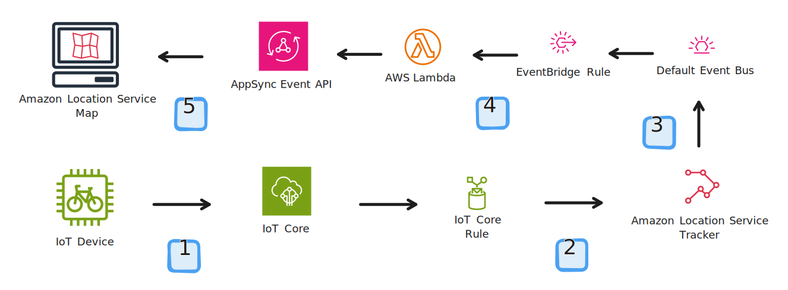
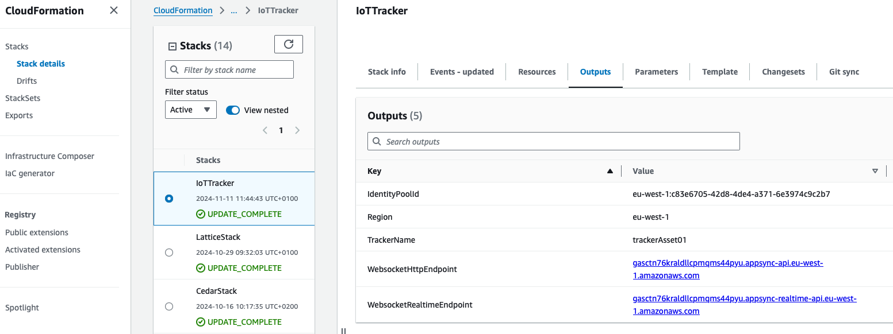
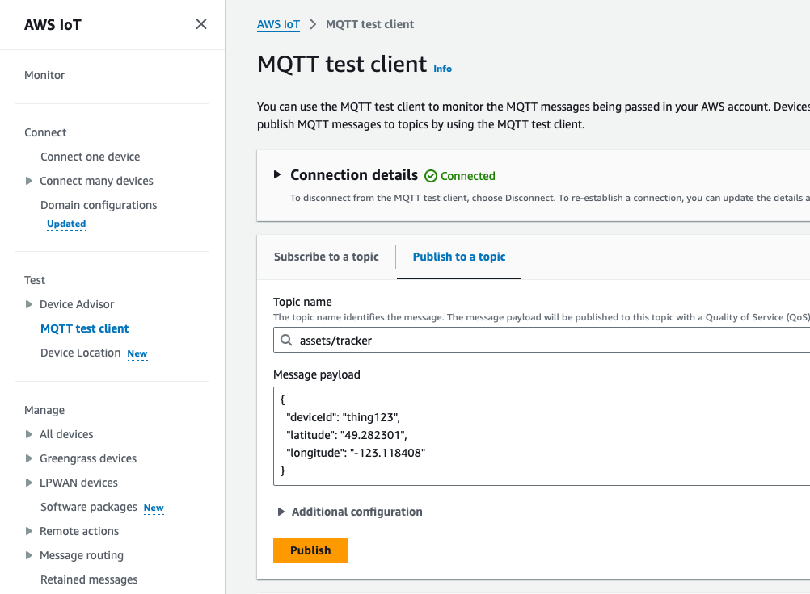
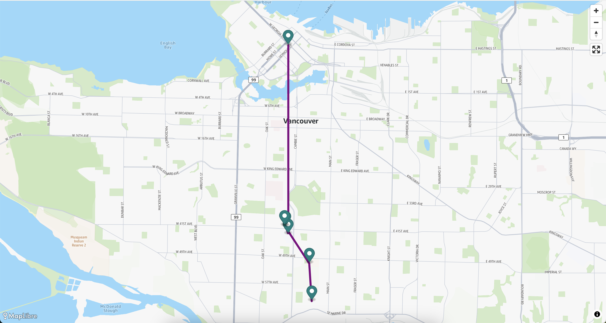

# Asset tracking with Amazon Location, AWS AppSync Events, and IoT Core

Amazon Location Service is a mapping service that allows you to add geospatial data and location functionality to applications, including dynamic and static maps, places search and geocodes, route planning, and device tracking and geofencing capabilities.

This project demonstrates how to build the foundation for an asset tracking application that receives device positions from IoT Core and updates a map in real-time using Amazon Location Service, AWS AppSync Events, and Amazon EventBridge.

## Overview of solution



1. A device sends its position to an IoT Core topic named `assets/tracker`.
2. An IoT Rule forwards the message to an Amazon Location Service Tracker.
3. The Tracker replicates the device position to an Amazon EventBridge event bus.
4. An EventBridge rule triggers a Lambda function that updates the device position in an AppSync Events API.
5. Frontend applications subscribed to the AppSync Events API receive the device position in real-time and display it on a map, also provided by Amazon Location Service.

### Prerequisites

For this project, you should have the following prerequisites:

- An AWS account with access to create and edit resources in the architecture
- Node.js (`>=v20.x`) and `npm` (`>=v10.x`) installed on your machine

## Getting Started

To get started, clone this repository and install the dependencies by running `npm ci` in the root folder:

```bash
git clone git@github.com:aws-samples/amazon-location-service-iot-asset-tracking.git
cd amazon-location-service-iot-asset-tracking
npm ci
```

## Deploy the infrastructure

Next, create the backend resources by deploying the CloudFormation template named `InfraStack.template.yaml` found in the `assets` folder.

### Deploy using the AWS CLI (preferred)

If you have the AWS CLI installed, you can run the following command to deploy the CloudFormation stack:

```bash
aws cloudformation create-stack --template-body file://assets/InfraStack.template.yaml --stack-name IoTTracker --capabilities CAPABILITY_IAM
```

Once the CloudFormation stack is created, you can get the values for the frontend application by running the following command:

```bash
 aws cloudformation describe-stacks \                                                                                                        
    --stack-name IoTTracker \
    --query 'Stacks[0].Outputs[*].[OutputKey,OutputValue]' \
    --output table
```

This command will return an output similar to the following:

```bash
----------------------------------------------------------------------------------------------------------
|                                             DescribeStacks                                             |
+----------------------------+---------------------------------------------------------------------------+
|  TrackerName               |  trackerAsset01                                                           |
|  WebsocketHttpEndpoint     |  gasctn76kraldllcpmqms44pyu.appsync-api.eu-west-1.amazonaws.com           |
|  Region                    |  eu-west-1                                                                |
|  IdentityPoolId            |  eu-west-1:c83e6705-42d8-4de4-a371-6e3974c9c2b7                           |
|  WebsocketRealtimeEndpoint |  gasctn76kraldllcpmqms44pyu.appsync-realtime-api.eu-west-1.amazonaws.com  |
+----------------------------+---------------------------------------------------------------------------+
```

### Manual deployment

If instead you prefer to work using the AWS Console, you can follow the [Deploying the CloudFormation template](https://docs.aws.amazon.com/AWSCloudFormation/latest/UserGuide/cfn-console-create-stack.html) page for instructions.

Once the CloudFormation stack is created, head to the "Outputs" tab to get the values for the frontend application.



## Configure the frontend application

Next, you need to configure the frontend application so it can connect to the backend resources.

To do so, create a `config.ts` file in the `src` folder with the following content:

> [!Note]
> You can also use the file at `src/config.example.ts` file as a template and rename it to `config.ts`. Make sure to replace the values with the ones from the CloudFormation stack outputs.

```js
const config = {
  /**
   * The AWS region where the resources are located
   *
   * @example 'eu-west-1'
   */
  region: '',
  /**
   * The Cognito Identity Pool ID
   *
   * @example 'eu-west-1:12345678-abcd-2345-efgh-6e3974c9c2b7'
   */
  identityPoolId: '',
  /**
   * The Amazon Location Service v2 map style name
   *
   * @example 'Standard', 'Monochrome', 'Hybrid', or 'Satellite'
   * @default 'Standard'
   */
  mapStyleName: 'Standard',
  /**
   * The AppSync Events API HTTP endpoint
   *
   * @example 'abcdef12ghilmnopqrstu34vwyz.appsync-api.eu-west-1.amazonaws.com'
   */
  httpDomain: '',
  /**
   * The AppSync Events API Realtime endpoint
   *
   * @example 'abcdef12ghilmnopqrstu34vwyz.appsync-realtime-api.eu-west-1.amazonaws.com'
   */
  realtimeDomain: '',
  /**
   * The AppSync Events API channel
   *
   * @example 'asset-tracker/thing123'
   * @default 'asset-tracker/thing123'
   */
  channel: 'asset-tracker/thing123',
};

export default config;
```

## Start the application

Next, you can start the frontend application by running the following command:

```bash
npm start
```

## Publish a position

To see the device position in the map, you need to send a position to the IoT Core topic `assets/tracker`. You can do this using the AWS CLI or the IoT Core AWS Console.

### Send using the AWS CLI

If you have the AWS CLI installed, you can send a position to the map by running the following command:

```bash
aws iot-data publish --topic assets/tracker \
  --payload '{"deviceId": "thing123", "latitude": "49.282301", "longitude": "-123.118408" }' \
  --cli-binary-format raw-in-base64-out
```

> [!Note]
> The commands don't return any output, but you should see the device position in the map after sending the message.

and then send another position:

```bash
aws iot-data publish --topic assets/tracker \
  --payload '{"deviceId": "thing123", "latitude": "49.292301", "longitude": "-123.119408" }' \
  --cli-binary-format raw-in-base64-out
```

### Send using the IoT Core AWS Console

To send a position to the map, log in into the [IoT Core AWS Console](https://console.aws.amazon.com/iot/home#/test) and publish a message to the `assets/tracker` topic:



```json
{
  "deviceId": "thing123",
  "latitude": "49.282301",
  "longitude": "-123.118408"
}
```

and then send another position:

```json
{
  "deviceId": "thing123",
  "latitude": "49.292301",
  "longitude": "-123.119408"
}
```

## Observe

Whenever you send a position to IoT Core, the position update should be sent to the Amazon Location Service Tracker and then to Amazon EventBridge.

The EventBridge rule will trigger a Lambda function that will update the device position in AppSync Events API, which the frontend application is subscribed to.



## Cleanup

To clean up the resources created in this project, you can delete the CloudFormation stack by running the following command:

```bash
aws cloudformation delete-stack --stack-name IoTTracker
```

## Additional details

AWS AppSync Events lets you create secure and performant serverless WebSocket APIs that can broadcast real-time event data to millions of subscribers, without you having to manage connections or resource scaling.

In this sample application we have a single namespace called `asset-tracker` and shared by all devices, with each one having its own channel. This allows you to broadcast messages to all devices or to a specific device. The channel name is composed of the namespace and the device ID, separated by a slash, like `asset-tracker/thing123`.

When a device sends a position to the IoT Core topic, it includes the device ID in the message. This device ID is used both for the Amazon Location Service Tracker and the AppSync Events API channel.

The frontend application subscribes to the AppSync Events API using the device ID as the channel name. This way, the application receives only the messages for the devices it is interested in.

The WebSocket API is secured using IAM. The Lambda function that pushes updates to the AppSync Events API has an IAM role that allows it to publish messages to the WebSocket API. Requests to the WebSocket API are signed using SigV4 ([see code](https://github.com/aws-samples/amazon-location-service-iot-asset-tracking/blob/8344f9d46c46649f8640f7bc61980ff20f67c244/assets/InfraStack.template.yaml#L197-L271)).

Likewise, the frontend application obtains temporary credentials using the Cognito Identity Pool ID and uses these credentials to sign requests to connect and subscribe to the WebSocket API ([see code](https://github.com/aws-samples/amazon-location-service-iot-asset-tracking/blob/8344f9d46c46649f8640f7bc61980ff20f67c244/src/hooks/useTracker.ts#L183-L214)).

For a more turnkey solution, you can use the [AWS Amplify](https://docs.amplify.aws/) library to connect to the AppSync Events API in a few lines of code.

## License

This library is licensed under the MIT-0 License. See the LICENSE file.
